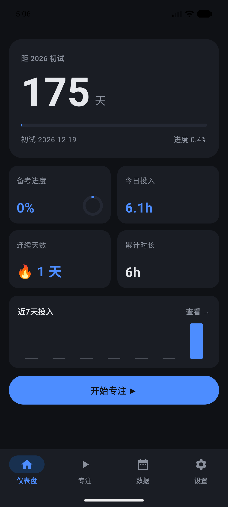
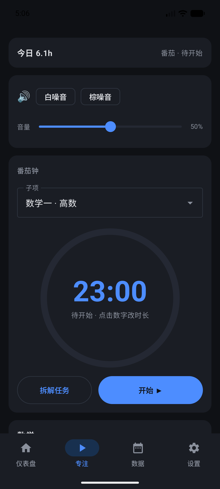
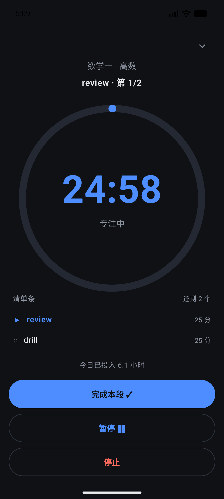
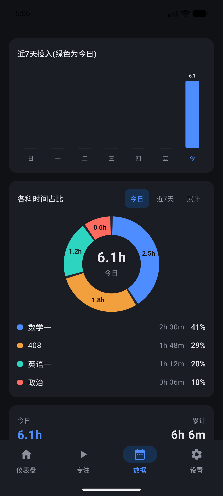

# 考研时间管理 (Kaoyan Timer)

[](https://github.com/38yuanzhao/kaoyan-timer/releases/latest)
[](https://github.com/38yuanzhao/kaoyan-timer/actions/workflows/android.yml)


给考研同学的**专注计时 + 学习数据复盘** App。番茄钟、初试倒计时、每日目标、热力图与学习记录一屏掌握 —— **纯本地、无需账号联网、深色护眼,免费**。装在 Android 7.0 及以上的手机上即可用。

<table>
<tr>
<td align="center"><br/><sub>仪表盘 · 初试倒计时</sub></td>
<td align="center"><br/><sub>番茄钟 · 选子项专注</sub></td>
<td align="center"><br/><sub>任务拆解链 · 分段接力</sub></td>
<td align="center"><br/><sub>数据 · 各科占比</sub></td>
</tr>
</table>

## 下载安装

到 **[Releases 页面](https://github.com/38yuanzhao/kaoyan-timer/releases/latest)** 下载最新的 `app-release.apk`,手机上点开直接装即可。首次安装如果系统提示,允许一次「未知来源 / 安装此来源应用」就行。

- **纯本地**:所有学习数据存在你手机里,不联网、不上传、不需要注册账号。
- **正式签名包**:Release 里的 `app-release.apk` 是正式签名的版本,能直接装、能正常升级覆盖(早期「装不上 / 签名冲突」的问题已修复)。
- 换手机也不丢数据:在「设置」里导出一份 JSON 备份,新手机导入即可迁移进度(详见下方功能列表)。

> 普通使用只需从 Releases 下载,**不用**去 Actions 里翻构建产物。

## 功能亮点

- **底部四标签导航**:仪表盘 / 专注 / 数据 / 设置,概览与高频操作分屏,告别功能堆成一长列。
- **初试倒计时**:仪表盘大号显示距初试天数,可点击在「天」与「时分」间切换;初试日期在设置里改。
- **概览数据卡**:仪表盘 2×2 卡片一眼看全 —— 备考进度(环形)、今日投入、连续天数、累计时长。
- **每日学习目标**:在设置中填写每天计划投入的分钟数,仪表盘用进度环实时显示「已投入 / 目标」与完成百分比;不设置时仍正常统计今日投入。
- **番茄钟**:选子项进行专注 / 休息循环,环形倒计时;**启动后整屏沉浸专注**,到点提示音 + 震动并自动结算到子项;可最小化返回(计时不停)。
- **任务拆解链(v2.3 新增)**:把一个子项拆成几段小任务、每段自定预估时长,App **自动接力**计时。预估时间到不强停,而是转「**超时正计时**」让你接着干;你点「完成本段」才结算 + 自动休息(按本段专注时长的 20%,3–20 分钟)+ 进下一段。锁屏 / 后台靠常驻通知继续推进,接力可靠;整条拆解跑完即清,下次重拆。
- **学习计时(秒表)**:每个科目选当前子项,一键开始 / 暂停,**运行中卡片蓝色高亮并自动置顶**;支持手动加减分钟(可负)。
- **月度学习热力图**:数据页按月展示每天的学习强度,可切换月份并查看选中日期的总投入与各科明细。
- **学习记录明细**:按时间倒序查看秒表、番茄、拆解链与手动调整记录;误记可确认删除,并同步回滚对应统计。
- **近 7 天图表 / 各科分布**:数据页柱状图(今日突出)+ 各科投入占比环形图(今日 / 近 7 天 / 累计可切换)。
- **桌面小组件**:无需打开 App 即可查看初试倒计时、今日实时投入与每日目标;点击小组件直接回到 App。
- **科目模板**:内置 11408 学硕 / 22048 专硕,科目顺序统一为 数学 → 408 → 英语 → 政治;在设置里切换(重置各科时长,保留每日统计)。
- **白 / 棕噪音**:内置雨声(白)与 Academic Brown(棕)真实录音,互斥切换 + 音量滑块,循环播放。
- **数据备份 / 多端同步**:设置里导出一份 JSON 备份,在另一台设备导入即可同步进度;无需账号、无需联网。
- **石墨蓝深色主题**:中性近黑 + 蓝色单强调,零阴影亮度分层,长时间使用更护眼。

## 更新

最新 **v2.7**:手动调整学习时间时可按需修改归属日期,默认仍记入当天。更早的 **v2.6** 在设置页新增 GitHub 检查更新与 APK 下载。历史版本见 [Releases](https://github.com/38yuanzhao/kaoyan-timer/releases)。

## 开发者:本地构建与技术栈

<details>
<summary>展开</summary>

### 在 Android Studio 中打开运行

1. 用 Android Studio(建议较新版本,AGP 8.5.2 / Gradle 8.7 兼容)打开本项目根目录。
2. 等待 Gradle 同步完成,首次同步会自动下载依赖。
3. 连接 Android 设备(开启 USB 调试)或启动一个 API 24 及以上的模拟器。
4. 点击工具栏的 **Run ▶**,选择目标设备即可安装运行。

命令行构建自测用的 debug 包:

```bash
./gradlew assembleDebug   # 产物:app/build/outputs/apk/debug/app-debug.apk(自测用,非发布物)
```

### 技术栈

- 语言:Kotlin 1.9.24
- UI:Jetpack Compose + Material3(Compose BOM 2024.06.00,Compose Compiler 1.5.14),石墨蓝深色主题;底部 NavigationBar 分屏(状态切换,未引入 Navigation-Compose)
- 构建:Gradle 8.7,AGP 8.5.2,Kotlin DSL
- SDK:minSdk 24,compileSdk 36,targetSdk 34;当前 versionName 2.6 / versionCode 8
- 持久化:SharedPreferences + kotlinx.serialization(JSON,1.6.3)
- 备份 / 同步:SAF(CreateDocument / OpenDocument)导出 / 导入 AppState 的 JSON
- 番茄运行保活:前台服务 `PomodoroService`(specialUse)+ 常驻通知,锁屏 / 后台继续计时与自动接力
- 音频:AudioTrack 合成提示音;MediaPlayer 循环播放内置雨声 / 棕噪音录音(`res/raw`,OGG/Vorbis);Vibrator 震动
- 架构:AndroidViewModel + StateFlow,单 AppState 发布模式
- 包名:`com.kaoyan.timer`

</details>
